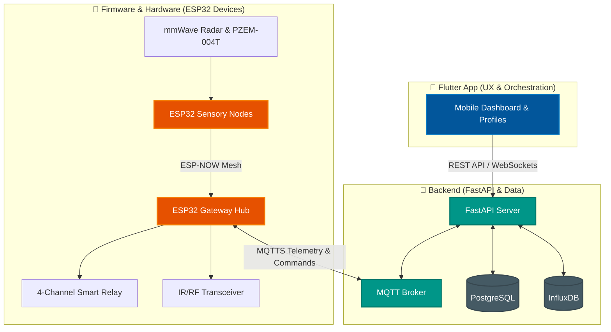
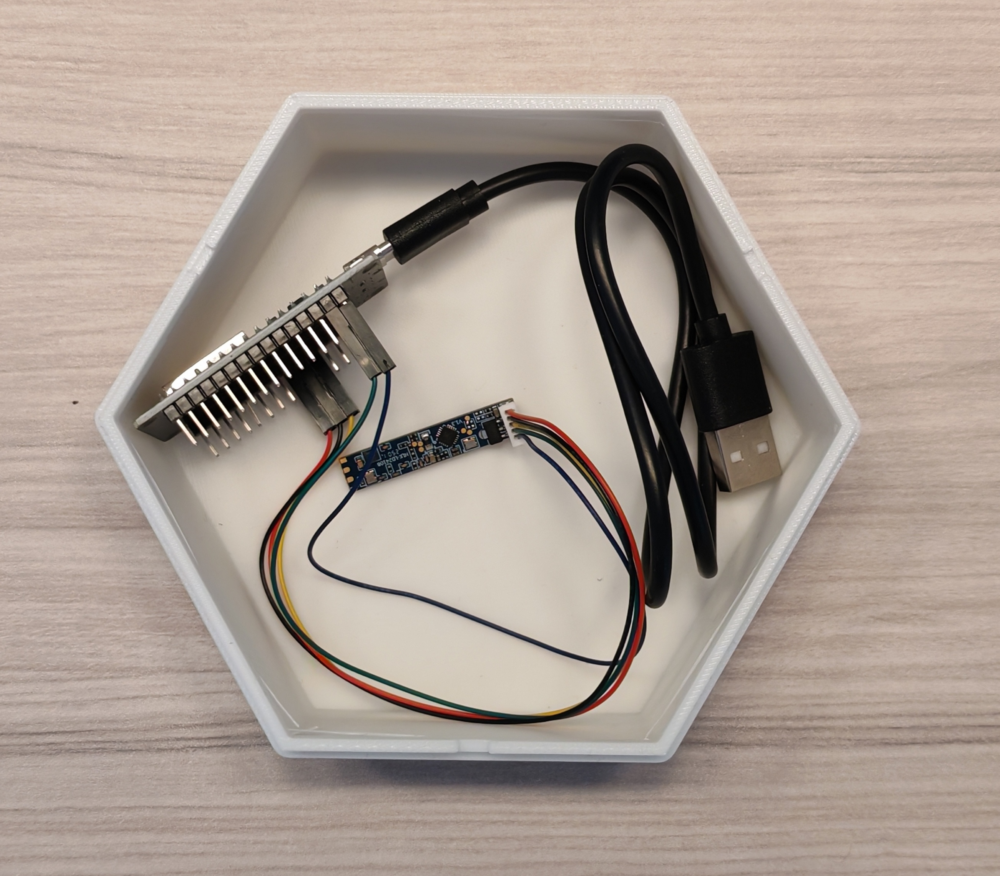
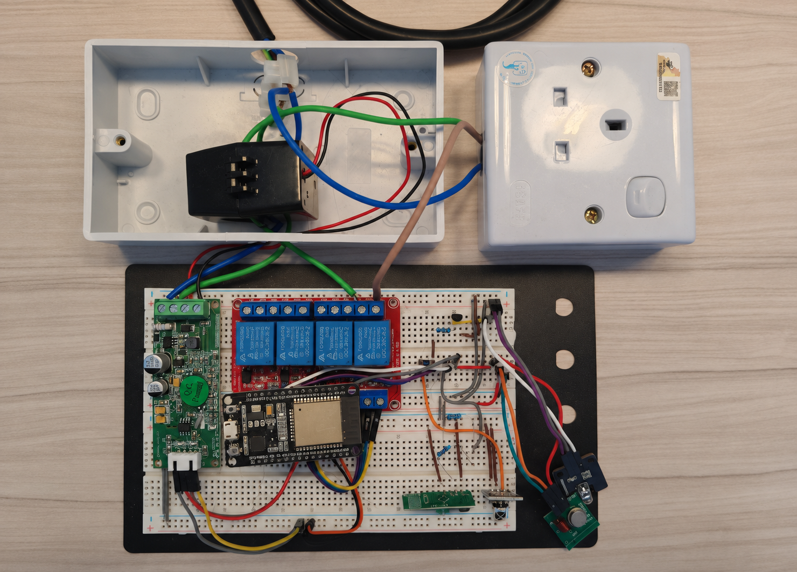
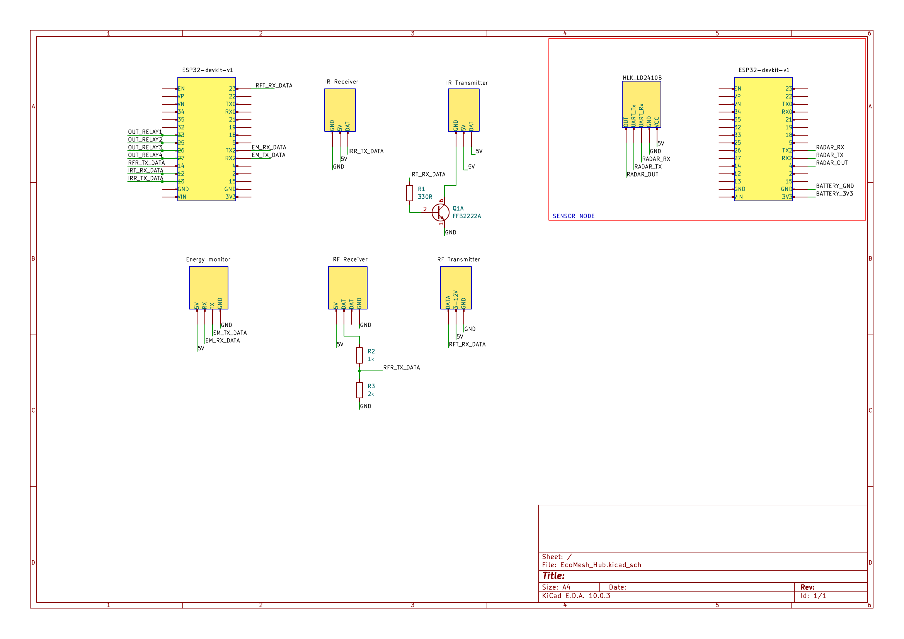

# EcoMesh: Smart Energy Management System

EcoMesh is an affordable residential smart-home energy management system that combines an ESP-NOW device network, retrofit-friendly controls, and a FastAPI backend to reduce household energy waste without costly rewiring.

*Low-Cost, Retrofit-Friendly Smart-Home Integration*

**Pitch Deck**: https://canva.link/cqd7eo5j1rgzzz7

## Abstract / Executive Summary

EcoMesh is a residential energy management prototype that makes smart-home integration accessible to more households. It combines low-cost ESP32 devices, high-fidelity mmWave sensing (HLK-LD2410B), universal IR/RF control, and smart relays to automate existing lights, appliances, and air-conditioning units. By detecting subtle human presence, EcoMesh can reduce standby "ghost power" and manage household devices without replacing them or rewiring the home. A Flutter application provides room controls and personalized comfort profiles from one simple interface.

## Problem Statement

Massive amounts of electricity are wasted daily due to inefficient energy usage practices:

- **Behavioral Neglect**: Lights, air-conditioning, and appliances are frequently left running in empty rooms. Standard motion sensors fail to detect stationary users, creating "environmental friction" that leads users to disable automation.
- **Standby Waste**: "Ghost power" is continuously drawn by idle devices like monitors and chargers.
- **Costly Smart-Home Upgrades**: Many smart-home products require replacing working appliances, buying multiple proprietary hubs, or modifying household wiring, putting them out of reach for renters and budget-conscious homeowners.

## Solution Overview & System Architecture

EcoMesh turns an existing home into a connected, responsive environment using affordable add-on devices that work with appliances people already own.



- **Hardware & Perception Layer (The "Nerves")**: Utilizes low-cost HLK-LD2410B mmWave Radar and ESP32-C3 nodes to detect subtle movement, ensuring accurate room occupancy detection even when residents are completely still (passing the "Breathing Test"). Household energy use is measured via PZEM-004T.
- **Control & Execution Layer (The "Muscle")**: Universal retrofitting through an integrated IR/RF transceiver that clones legacy remote commands. A 4-Channel Relay physically cuts circuits to idle devices when a room is vacated, killing "ghost power".
- **Connectivity & Automation Layer (The "Brain")**: FastAPI, MQTT, PostgreSQL, and InfluxDB coordinate device commands, household telemetry, room status, and automation rules across the home.
- **User Experience (The "Experience")**: A minimal Flutter app lets residents control rooms and create personalized comfort profiles that follow them around the home.

## Key Features & Innovation

- **"Follow-Me" Home Profiles**: Personalized comfort and energy settings can follow residents between rooms instead of relying on rigid schedules.
- **Occupancy-Triggered "Ghost Power Hunter"**: Doesn't just turn off lights; it physically severs power to standby electronics when a room becomes vacant.
- **Affordable Retrofitting**: Low-cost controllers clone existing IR/RF remote signals and switch existing circuits, bringing smart-home features to ordinary homes without replacing appliances or rewiring.
- **Unified Household Control**: One mobile interface brings room status, appliance control, and automation settings together.

## Tech Stack

- **Hardware**: ESP32-S3 (Gateway Hub), ESP32-C3 (Sensory Nodes), HLK-LD2410B mmWave Radar, 4-Channel Relay, PZEM-004T, IR/RF Transceiver
- **Firmware**: C++ (PlatformIO / ESP-IDF)
- **Backend API**: FastAPI (Python), SQLAlchemy
- **Databases**: PostgreSQL (Relational Data), InfluxDB (Time-Series Telemetry)
- **Frontend App**: Flutter (Dart)
- **IoT Messaging**: MQTT (over TLS/SSL)

## Hardware Prototype

<p align="center">
  
  
</p>

<p align="center"><em>Sensor node (left) and smart strip controller (right).</em></p>

### System Schematic

<p align="center">
  <a href="docs/assets/hardware/ecomesh-schematic.pdf">
    
  </a>
</p>

<p align="center"><em>Click the schematic to open the original PDF.</em></p>

---

## 🛠️ Prerequisites

Before you begin, ensure you have the following installed on your development machine:

* **Software:**
  * [Python 3.10+](https://www.python.org/)
  * [Flutter SDK (3.19+)](https://docs.flutter.dev/get-started/install)
  * [VS Code](https://code.visualstudio.com/) with the **PlatformIO** extension installed.
  * [Docker Desktop](https://www.docker.com/products/docker-desktop/) (for running databases easily).
* **Hardware:**
  * 1x ESP32-DevKitV1 (Gateway Hub)
  * 1+ ESP32-CH340 (Sensory Nodes)
  * HLK-LD2410 mmWave Radar Sensor
  * 4-Channel 5V Relay Module
  * 940nm IR Emitter + 2N2222 Transistor

---

## 🐳 Step 1: Fully Containerized Dev Setup

The root `docker-compose.yml` now starts PostgreSQL, InfluxDB, and the FastAPI backend together. The backend container uses the service names `postgres` and `influxdb`, so no host networking is needed.

1. Start everything:

```bash
docker compose up --build
```

2. Open the backend API:

```text
http://localhost:8000
```

3. Open InfluxDB:

```text
http://localhost:8086
```

## 🧠 Backend Container

The backend image is built from [backend/Dockerfile](backend/Dockerfile) and runs Uvicorn with auto-reload for development. The container mounts `./backend:/app`, so code changes are picked up without rebuilding the image.

If you want to run the backend outside Docker, copy `backend/.env.example` and change `POSTGRES_SERVER` to `localhost` and `INFLUX_URL` to `http://localhost:8086`.

## 🗄️ Database Setup Guide

### PostgreSQL

The database is initialized from the Compose environment:

```yaml
POSTGRES_USER=postgres
POSTGRES_PASSWORD=postgrespassword
POSTGRES_DB=ecomesh_db
```

The backend connects with:

```yaml
POSTGRES_SERVER=postgres
```

Use these connection details in psql or a GUI client:

```text
Host: localhost
Port: 5432
Database: ecomesh_db
User: postgres
Password: postgrespassword
```

### InfluxDB

InfluxDB is initialized with:

```yaml
DOCKER_INFLUXDB_INIT_USERNAME=admin
DOCKER_INFLUXDB_INIT_PASSWORD=adminpassword
DOCKER_INFLUXDB_INIT_ORG=um_technothon
DOCKER_INFLUXDB_INIT_BUCKET=sensor_metrics
DOCKER_INFLUXDB_INIT_ADMIN_TOKEN=ecomesh-secure-token
```

The backend connects with:

```yaml
INFLUX_URL=http://influxdb:8086
```

For the Influx UI or CLI, use:

```text
URL: http://localhost:8086
Org: um_technothon
Bucket: sensor_metrics
Token: ecomesh-secure-token
```

### First Run Checklist

1. Run `docker compose up --build`.
2. Wait for PostgreSQL to finish initialization.
3. Open InfluxDB once, complete any first-time setup if needed, and confirm the bucket exists.
4. Power on the hub and sensor nodes, then confirm that room telemetry appears in the Flutter app.

## Local Non-Docker Mode

If you prefer running the backend directly on Windows:

```bash
cd backend
python -m venv venv
venv\Scripts\activate
pip install -r requirements.txt
uvicorn main:app --reload --host 0.0.0.0 --port 8000
```

## ⚡ Step 3: Hardware Firmware (PlatformIO)
**Part A: The Gateway Hub**

1. Open the firmware/eco_zone_hub_esp32 folder in VS Code.

2. Connect your ESP32-DevKitV1 via USB.

3. Click the PlatformIO Upload button (the right arrow → on the bottom taskbar).

4. Open the Serial Monitor (the plug icon 🔌). Note the Gateway Base MAC Address printed in the console.

**Part B: The Sensory Node**

1. Open the firmware/eco_sensor_node_esp32 folder in VS Code.

2. Open src/main.cpp.

3. Locate the gatewayMacAddress array and update it with the MAC address you copied in Part A:

``` C++
uint8_t gatewayMacAddress[] = {0x24, 0x0A, 0xC4, 0xXX, 0xXX, 0xXX}; // Update this!
```

4. Connect your ESP32-CH340 node via USB and click Upload.

## 📱 Step 4: Frontend App (Flutter)
1. Navigate to the Flutter app directory:

``` bash
cd apps/ecomesh_flutter
``` 

2. Fetch Flutter dependencies:

``` bash
flutter pub get
``` 

3. Update the API Endpoint:
Open lib/core/constants/api_constants.dart (or wherever you store base URLs) and ensure it points to your local machine's IP address (e.g., http://192.168.X.X:8000/api/v1).
(Note: Do not use localhost if testing on a physical Android/iOS device).

4. Run the app:

``` bash
flutter run
``` 

