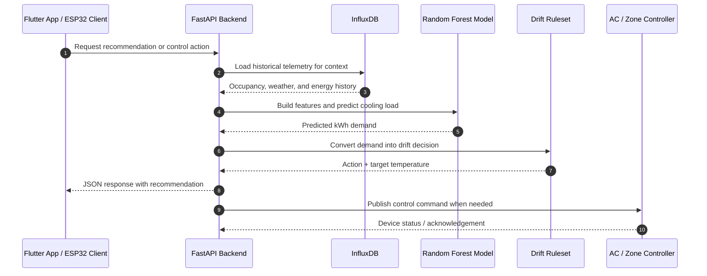

# EcoMesh Backend

EcoMesh backend is a FastAPI service that powers the smart energy workflow for the Flutter app, ESP32 devices, and the ML-based cooling advisor. It handles authentication, zone control, notifications, analytics, MQTT communication, and predictive AC tuning.

## What the backend does

The backend is not just a CRUD API. It coordinates four main responsibilities:

1. Authentication and user profiles for the mobile app.
2. Live zone, control, notification, and analytics APIs.
3. MQTT bridging to ESP32 gateway devices.
4. Machine learning inference for energy-aware AC recommendations.

## Project layout

- `main.py` - FastAPI entry point, middleware, CORS, and startup/shutdown lifecycle.
- `api/v1/` - Versioned REST routes.
- `config/` - Settings and database connection helpers.
- `core/` - Security and middleware utilities.
- `database/` - SQLAlchemy models, schemas, and declarative base.
- `ml_engine/` - Data loading, model training, and inference pipeline.
- `services/` - MQTT, weather, tariff, and other integration services.

## Key backend features

### Authentication

The auth module supports:

- User registration
- Username/password login using OAuth2 password form flow
- JWT token generation
- Authenticated profile lookup via `/auth/me`

The Flutter app sends the user email as the OAuth2 `username` field together with the password, then stores the returned JWT securely.

### Zone and control APIs

The backend exposes endpoints for reading and updating zone state, issuing control actions, and coordinating device commands. These routes are grouped under:

- `/api/v1/zones`
- `/api/v1/control`

### Notifications and analytics

The notification and analytics modules provide the application with live status information, recent events, and energy insights under:

- `/api/v1/notifications`
- `/api/v1/analytics`

### MQTT bridge

On startup, the backend connects to the MQTT broker so it can publish commands and receive updates from ESP32 gateways. This is initialized in `main.py` through `mqtt_bridge.connect()` and shut down cleanly on exit.

## ML model overview

EcoMesh uses a predictive energy model instead of a simple thermostat rule engine. The model estimates how much cooling load is needed, then converts that prediction into an AC target temperature using a drift ruleset.

The main ML files are:

- `ml_engine/pipelines/train_pipelines.py` - trains and saves the model.
- `ml_engine/pipelines/inference.py` - loads the model and produces live recommendations.

### Training pipeline

`train_pipelines.py` loads historical telemetry from InfluxDB, engineers time-based features, trains a `RandomForestRegressor`, evaluates it, and saves the trained model to `ml_engine/models/demand_forecast.pkl`.

The training inputs are:

- `occupancy_count` - number of people in the zone.
- `outdoor_temp` - current outside temperature.
- `hour` - hour of day extracted from the telemetry timestamp.
- `day_of_week` - weekday index, where Monday is 0.
- `is_weekend` - binary flag for weekend behavior.

The prediction target is:

- `energy_draw_kwh` - the historical cooling/energy demand that the model learns to approximate.

### Why Random Forest

Random Forest is used because the relationship between occupancy, weather, and cooling demand is non-linear. For example, a room changing from 2 people to 20 people does not increase load in a straight line. A tree ensemble handles this kind of behavior better than a simple linear model.

### Inference pipeline

`inference.py` loads the saved model and takes live inputs from the app or device layer. It builds the same feature set used during training, predicts the cooling load, then applies the drift ruleset.

The inference result includes:

- `predicted_kwh_load` - estimated energy demand.
- `suggested_action` - one of the drift actions.
- `target_ac_temp` - the temperature the AC should use.

### Drift ruleset

The drift logic converts model output into practical AC instructions:

- `SHUTDOWN` - if occupancy is 0, stop cooling.
- `AGGRESSIVE_DRIFT` - if load is low and outdoor temperature is cool, drift to 26°C.
- `STANDARD_ECO` - moderate conditions use 24°C.
- `MAX_COOLING` - high occupancy and high heat load push the AC to 22°C.

This keeps the room comfortable while avoiding unnecessary compressor runtime.

## Core backend functions

### `main.py`

- Creates the FastAPI app.
- Adds CORS support for the Flutter client.
- Adds a custom process-time middleware.
- Registers all versioned API routes.
- Connects and disconnects MQTT during app startup and shutdown.

### `core/security.py`

- Hashes user passwords.
- Verifies login credentials.
- Creates JWT access tokens.

### `config/database.py`

- Builds the SQLAlchemy engine and session factory.
- Exposes `get_db()` for request-scoped database access.

### `seed_test_user.py`

- Creates the test user used by the Flutter login screen.
- Creates sample zones for demo and development.

### `ml_engine/pipelines/train_pipelines.py`

- Fetches historical telemetry.
- Builds training features.
- Trains the demand forecast model.
- Saves the trained model artifact.

### `ml_engine/pipelines/inference.py`

- Loads the trained model.
- Builds live features.
- Predicts cooling demand.
- Converts the prediction into a temperature action.

## API routes

- `POST /api/v1/auth/register` - create a new user.
- `POST /api/v1/auth/login` - exchange email and password for a JWT token.
- `GET /api/v1/auth/me` - get the current user profile.
- `GET /api/v1/zones` - read zone information.
- `GET /api/v1/analytics` - fetch analytics data.
- `GET /api/v1/notifications` - fetch notification data.
- `POST /api/v1/control` - send control commands.

## Local setup

1. Install dependencies:

	```bash
	pip install -r requirements.txt
	```

2. Seed the test user and demo zones:

	```bash
	python seed_test_user.py
	```

3. Start the backend:

	```bash
	uvicorn main:app --reload --host 0.0.0.0 --port 8000
	```

4. Open the interactive API docs:

	```
	http://127.0.0.1:8000/docs
	```

## Test login credentials

- Email: `test@example.com`
- Password: `password123`

## Notes for the Flutter app

- Android emulator should use `http://10.0.2.2:8000` instead of `localhost`.
- A physical device should use your machine's LAN IP address.
- The login endpoint expects OAuth2 form fields, not JSON.

## ML flow summary

1. Historical telemetry is loaded from InfluxDB.
2. The model learns how occupancy, weather, and time affect energy demand.
3. Live inputs are passed to inference.
4. The predicted load is translated into an AC target temperature.
5. The backend returns a comfortable but energy-aware recommendation.

## Model flow sequence



The diagram shows the two-layer decision path: first the model estimates cooling demand, then the drift rules turn that prediction into a practical AC instruction.
